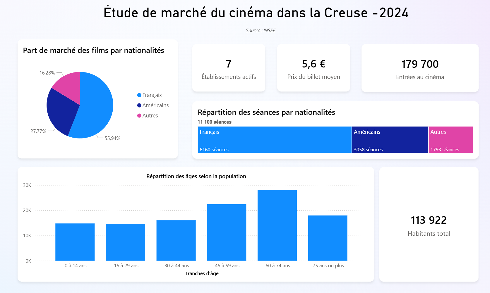
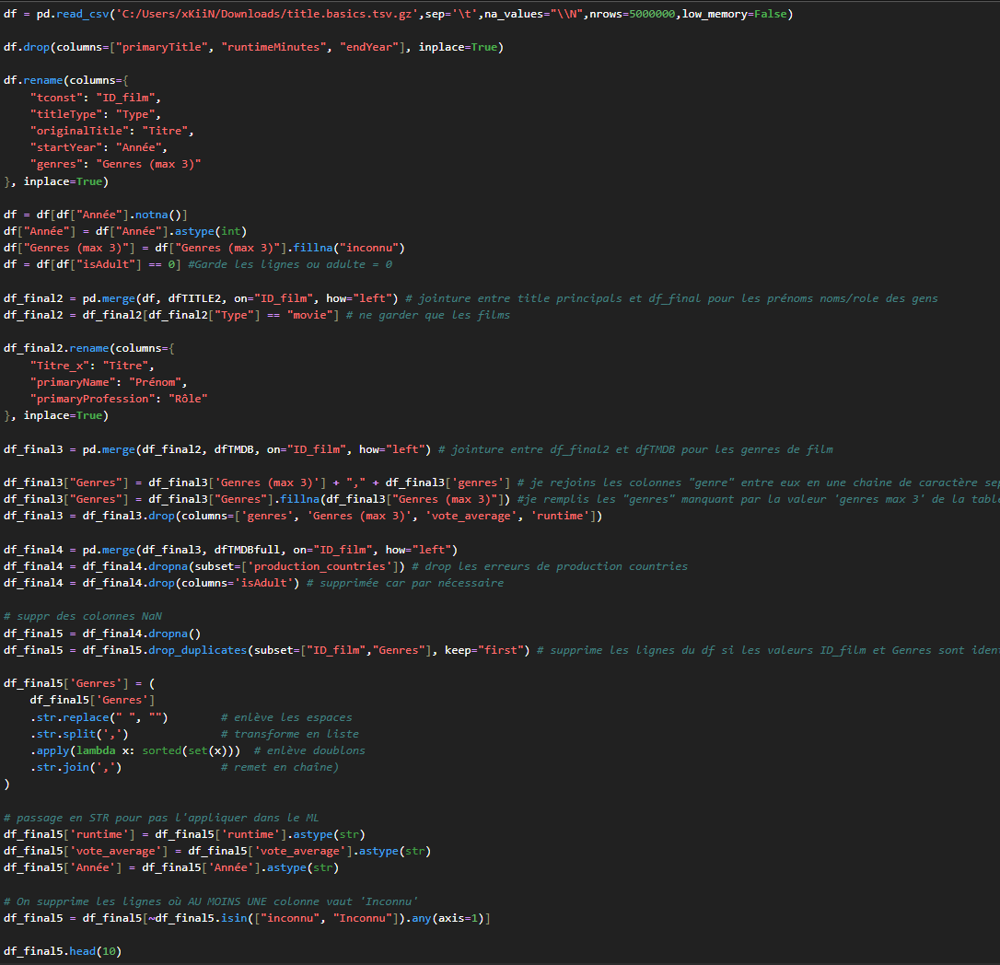
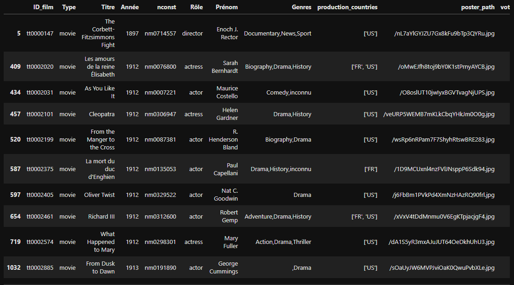
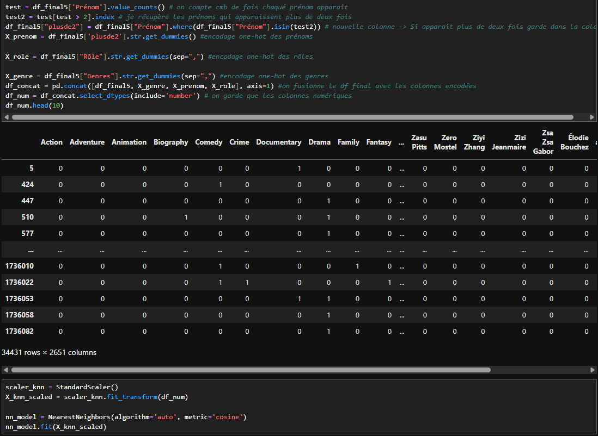
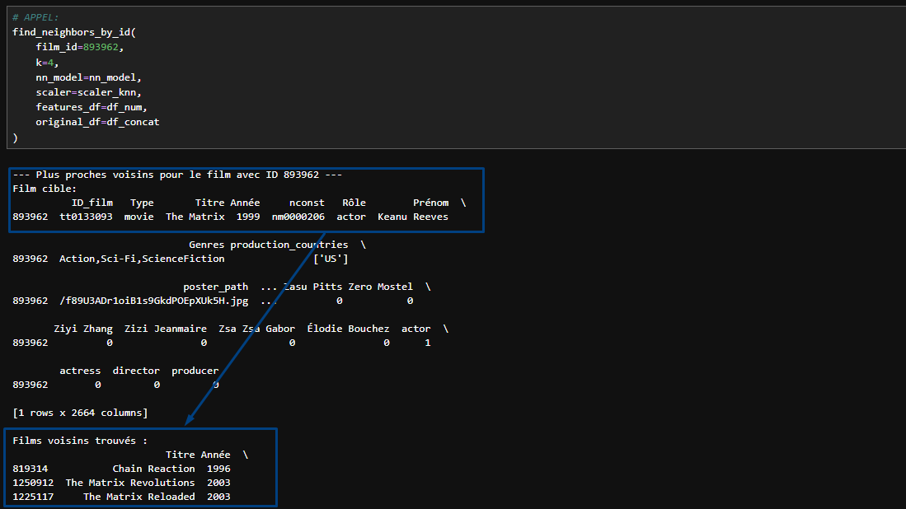

# 🍿 Projet WildMovie

## 🌐 Accès au site

Le site web développé dans le cadre du projet **WildMovie** est accessible à l’adresse suivante :  
👉 https://wildmovies.streamlit.app

## 📌 Contexte

Lorsqu’on accède au service Netflix, le système de recommandations aide l’utilisateur à trouver aussi facilement que possible les séries TV ou films qu’il pourrait apprécier, grâce à un système de recommandation. 

Netflix calcule ainsi la probabilité que l’utilisateur regarde un titre donné du catalogue de Netflix, et peut ainsi optimiser ces partenariats ou plus globalement sa stratégie marketing. Netflix est l’archétype de la société data-driven.

**Votre client n’est pas Netflix, mais il a de grandes ambitions !**

---

## 🧩 Objectifs & Enjeux

Vous êtes un **Data Analyst freelance.**
Un cinéma en perte de vitesse situé dans la Creuse vous contacte afin de passer le cap du digital en créant un site Internet destiné aux habitants locaux.

**Commencez par une étude de marché sur la consommation de cinéma dans la région de la Creuse, afin de mieux comprendre les attentes et les préférences du public local.**

Sur la base des informations récoltées, vous pourrez affiner votre programmation en vous spécialisant par exemple sur les films des années 90 ou les genres d’action et d’aventure, afin de mieux répondre aux attentes du public identifié lors de l’étude de marché.

**L’objectif à terme est de développer un moteur de recommandations de films.**

---

## 📊 Étude de marché

Le projet débute par une étude de marché sur la consommation de cinéma dans la région de la Creuse, afin de mieux comprendre les attentes et préférences du public local.
**Cette étape nous a permis de définir une orientation adaptée pour la suite de l’analyse.**

---

## 🔍 Nettoyage des données & Exploration

Les données utilisées dans cette étude de marché proviennent des **datasets publics IMDb.**
Ces jeux de données bruts nécessitent une phase de préparation avant toute analyse.

- Inspection des données (structure, types, valeurs manquantes)
- Suppression ou traitement des valeurs manquantes
- Suppression des doublons
- Harmonisation des noms de colonnes
- Conversion des types de données
- Sélection des variables pertinentes pour l’analyse

**Ces étapes permettent d’obtenir un jeu de données propre, cohérent et exploitable.**
<table>
  <tr>
    <td align="center">
      
       
      <strong>Code de nettoyage des données</strong>
    </td>
    <td align="center">
      
       
      <strong>Résultat après nettoyage des données</strong>
    </td>
  </tr>
</table>

---

## 🤖 Machine Learning

Après le nettoyage et l’exploration des données issues des datasets IMDb, une phase de machine learning supervisé a été mise en place afin de **réaliser des prédictions basées sur la similarité entre observations.**

- Segmenter les films/séries selon leurs caractéristiques
- Prédire une variable cible à partir des caractéristiques des films/séries
- Analyser la similarité entre contenus IMDb

Avant l’entraînement des modèles :

- Sélection des variables numériques pertinentes
- Normalisation des données
- Séparation des données en ensembles d’entraînement et de test

**L’algorithme K-Nearest Neighbors (KNN) a été utilisé.**

### Résultats

<table>
  <tr>
    <td align="center">
      
       
      <strong>Code du modèle K-Nearest Neighbors</strong>
    </td>
    <td align="center">
      
       
      <strong>Résultats des prédictions</strong>
    </td>
  </tr>
</table>

---

## 🛠️ Outils Utilisés  

- **Langage :** Python
- **Manipulation des données :** Pandas
- **Machine Learning :** Scikit-learn (K-Nearest Neighbors)
- **Visualisation des données :** Power BI

## ⭐ Projet réalisé par :
- Mourad B.
- Priscilla M.
- Romain M.
- Sebastian P.
